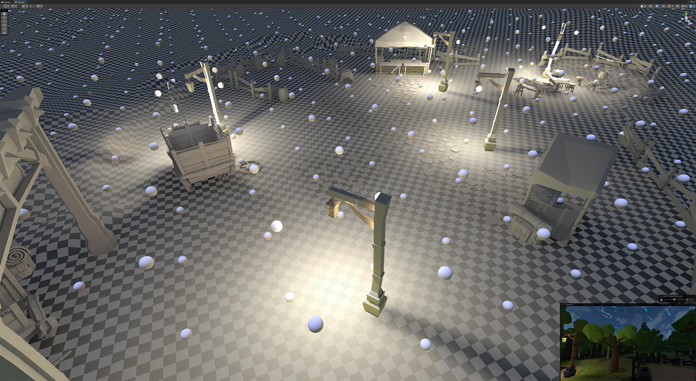

# Описание проекта

Собрана казуальная открытая сцена лесного лагеря с рыночными прилавками (Main.scene), используя бесплатные ассеты из Unity Asset Store. Некоторые модели деревьев были адаптированы в Blender для удобного использования в кастомных шейдерах.

Все объекты окружения сгруппированы в префабы. На Terrain размещены деревья, камни, мелкие детали, нанесены тропинки и различные текстуры ландшафта.

Объекты разделены на static и dynamic для оптимизации. Запечен Occlusion Culling (OC).

Реальное число вызовов отрисовки отслеживается через Frame Debugger (Stats некорректен).

Примерное число draw calls для разных уровней графики:
- Low – ~100
- Medium – ~200
- High – ~300

Включены SRP Batching и GPU Instancing.

## Шейдеры

Созданы кастомные шейдеры через Shader Graph:

1. **Шейдер вегетации**:
   - Использует маску через Vertex Color и искажение вершин для имитации движения листвы, зависящего от направления и скорости ветра.

   

2. **Шейдер Billboard**:
   - Используется для объектов вегетации (LOD 1).
   - Поворот в сторону камеры реализован кастомной HLSL-функцией.

3. **Комплексный шейдер воды**:
   - Учитывает направление ветра, рябь, волны.
   - Имеет текстурную маску для тины.
   - Цвет воды меняется в зависимости от глубины и соприкосновения с другими объектами (карта глубины).
   - Изображение под водой искажается по мере увеличения глубины.
   - Unlit-шэйдер с поддержкой отражений и освещения.

   

## Скриптовая часть

Создан контроллер сцены с компонентами:

- **CameraGraphicSettingsController**
  - Слушает ивент смены графики, загружает и применяет параметры из CameraSettings (serialized asset).
  - Ивент доступен через меню (menu/tools/quality).

- **WindController**
  - Управляет системой ветра, соединенной с VFX эффектами, шейдером вегетации и волнами на воде.
  - Для разнообразия ветра используется скрипт RandomWindChanger, который случайно изменяет направление и силу ветра и отправляет контроллеру соответствующий ивент.

- **Third Person Controller**
  - Управляет персонажем, камерой и реализует 2D BlendTree Simple Directional (анимации Mixamo).

  

## Инструментарий

Созданы полезные инструменты для удобства работы:

1. **Автоматическая расстановка Light Probes** по поверхности Terrain с заданным шагом и количеством слоев.
2. **Экспортер Terrain в формат FBX**.
3. **Billboard-генератор** для префабов растительности.

## Настройка URP рендера

- Настроены Render Pipeline Assets и дополнительные параметры для трех уровней графики (Low, Medium, High).
- Настройки камеры также изменяются согласно выбранному уровню графики.

## Настройка освещения и запекание

- Выставлены источники освещения, настроен Environment.
- Установлены Light Probes и Reflection Probes.
- Используется Mixed и Baked освещение.
- Lightmap карты запечены в разрешении 2K (лучше было бы 4K для батчинга, но ограничения размера файлов GitHub не позволяют; LFS также не использовался по той же причине).
- Установлены ограничения на количество карт освещения: 3 карты + 1 для Terrain.

## Визуальные эффекты

Созданы два комплексных VFX эффекта (с использованием VFX Graph):

1. **Листва, поднимаемая ветром**
   - Эффект синхронизирован с системой ветра.
   - Реализован через Output Particle Quad.

2. **Падающие кометы на ночном небе**
   - Использует системы Heads, Sparks, Trails.
   - Trails имеет кастомный шейдер для правильного масштабирования линии и решения проблемы с Quadrilateral Interpolation.

