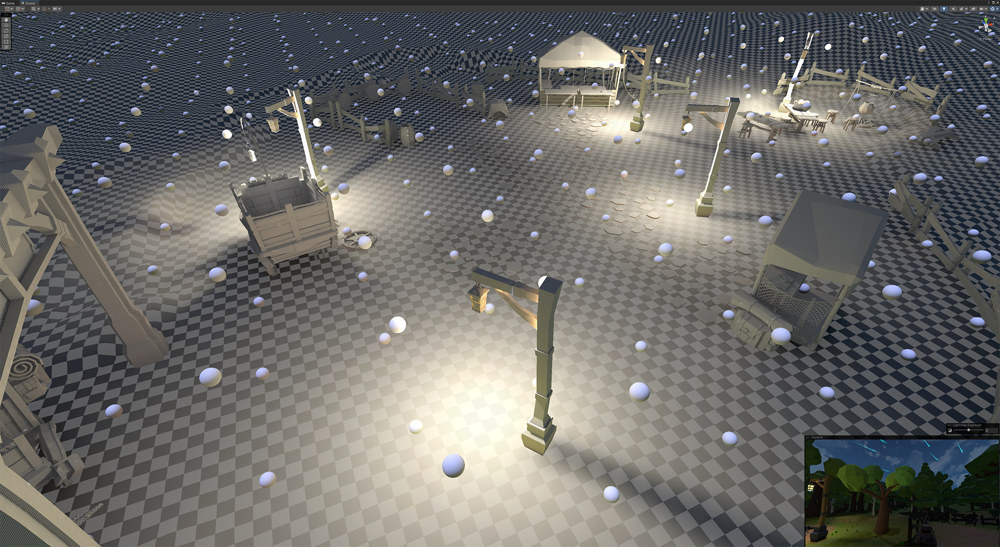

# Project Description

A casual open scene of a forest camp with market stalls (Main.scene) was assembled using free assets from the Unity Asset Store. Some tree models were adapted in Blender for easier use with custom shaders.

All environment objects are grouped into prefabs. Trees, rocks, and small details are placed on the Terrain, along with paths and various landscape textures.

Objects are split into static and dynamic for optimization. Occlusion Culling (OC) has been baked.

SRP Batching and GPU Instancing are enabled.

## Shaders

Custom shaders were created using Shader Graph:

1. **Vegetation shader**:
   - Uses a mask via Vertex Color and vertex displacement to simulate foliage movement based on wind direction and speed.

   

2. **Billboard shader**:
   - Used for vegetation objects (LOD 1).
   - Camera-facing rotation is implemented via a custom HLSL function.

3. **Advanced water shader**:
   - Takes wind direction into account, including ripples and waves.
   - Includes a texture mask for algae.
   - Water color changes depending on depth and intersection with other objects (depth map).
   - Underwater image distortion increases with depth.
   - An Unlit shader with support for reflections and lighting.

   

## Scripting

A scene controller was created with the following components:

- **CameraGraphicSettingsController**
  - Listens for a graphics quality change event, loads and applies parameters from CameraSettings (serialized asset).
  - The event is available via the menu (menu/tools/quality).

- **WindController**
  - Controls the wind system connected to VFX effects, the vegetation shader, and water waves.
  - For more wind variety, a RandomWindChanger script is used. It randomly changes wind direction and strength and sends the corresponding event to the controller.

- **Third Person Controller**
  - Controls the character and camera and implements a 2D Blend Tree (Simple Directional) using Mixamo animations.

  

## Tooling

Several useful tools were created to improve workflow:

1. **Automatic Light Probe placement** across the Terrain surface with a specified step and number of layers.
2. **Terrain-to-FBX exporter**.
3. **Billboard generator** for vegetation prefabs.

## URP Render Setup

- Render Pipeline Assets and additional settings were configured for three graphics quality levels (Low, Medium, High).
- Camera settings are also adjusted according to the selected graphics quality level.

## Lighting Setup and Baking

- Light sources were placed and the Environment was configured.
- Light Probes and Reflection Probes were set up.
- Mixed and Baked lighting is used.
- Lightmaps were baked at 2K resolution (4K would be better for batching, but GitHub file size limitations prevent it; Git LFS was also not used for the same reason).
- Limits were set for the number of lightmaps: 3 maps + 1 for the Terrain.

## Visual Effects

Two advanced VFX effects were created using VFX Graph:

1. **Wind-blown leaves**
   - The effect is synced with the wind system.
   - Implemented using Output Particle Quad.

2. **Falling comets in the night sky**
   - Uses Heads, Sparks, and Trails systems.
   - Trails use a custom shader to properly scale the line and solve the Quadrilateral Interpolation issue.

